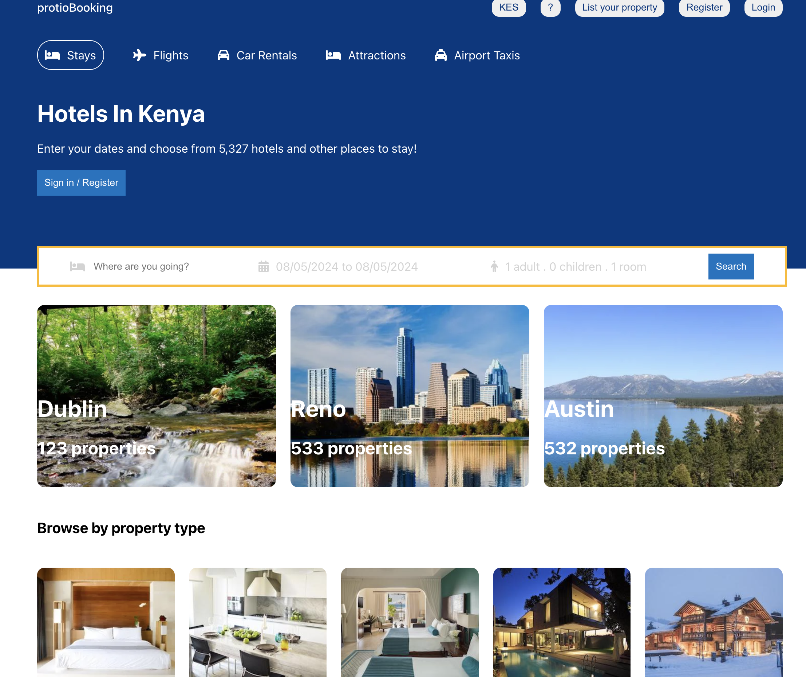
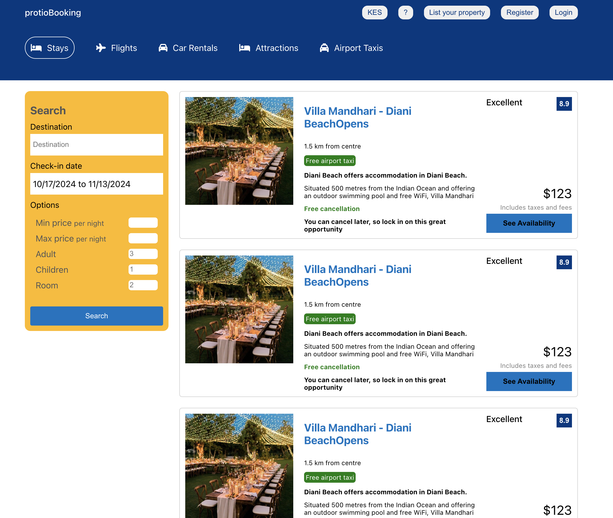
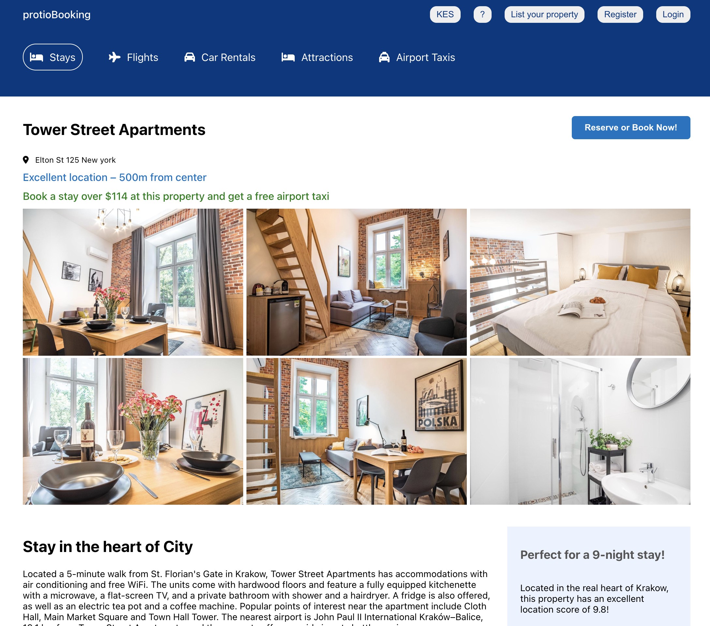

# Travel Advisor App

Welcome to the Travel Advisor App! This app helps you find and book hotels, flights, car rentals, attractions, and airport taxis for your travels. Below, you'll find an overview of the app's features, installation instructions, and usage guidelines.

## Features

- **Search and Book Hotels:** Find and book hotels with ease by searching for your destination and travel dates.
- **Browse by Property Type:** Discover different types of properties, such as villas, apartments, and more.
- **Filter Options:** Narrow down your search with filters for price range, number of adults, children, and rooms.
- **View Hotel Details:** Get detailed information about hotels, including location, amenities, price, and availability.
- **User Authentication:** Register and log in to manage your bookings and preferences.

## Screenshots

### Home Page


### Search Results


### Hotel Details


## Installation

To set up the Travel Advisor App locally, follow these steps:

1. **Clone the repository:**
   ```sh
   git clone https://github.com/Kip-rotich46/travel-advisor-app.git
   cd travel-advisor-app
   ```

2. **Install dependencies:**
   ```sh
   npm install
   ```

3. **Start the development server:**
   ```sh
   npm start
   ```

4. **Open the app in your browser:**
   Navigate to `http://localhost:3000` to view the app.

## Usage

### Searching for Hotels

1. Enter your destination in the search bar on the home page.
2. Select your check-in and check-out dates.
3. Specify the number of adults, children, and rooms.
4. Click the "Search" button to view available hotels.

### Filtering Results

1. Use the filters on the left sidebar to set your desired price range and number of guests.
2. Click "Search" to update the results based on your filters.

### Viewing Hotel Details

1. Click on a hotel from the search results to view detailed information.
2. See photos, amenities, pricing, and availability.
3. Click "Reserve or Book Now!" to proceed with booking.

## Contributing

We welcome contributions to improve the Travel Advisor App. If you'd like to contribute, please follow these steps:

1. Fork the repository.
2. Create a new branch with your feature or bug fix.
3. Commit your changes and push to your branch.
4. Open a pull request to merge your changes into the main branch.

## License

This project is licensed under the MIT License. See the LICENSE file for details.

---

For any questions or support, please contact us at https://www.linkedin.com/in/gideon-langat


Happy traveling!